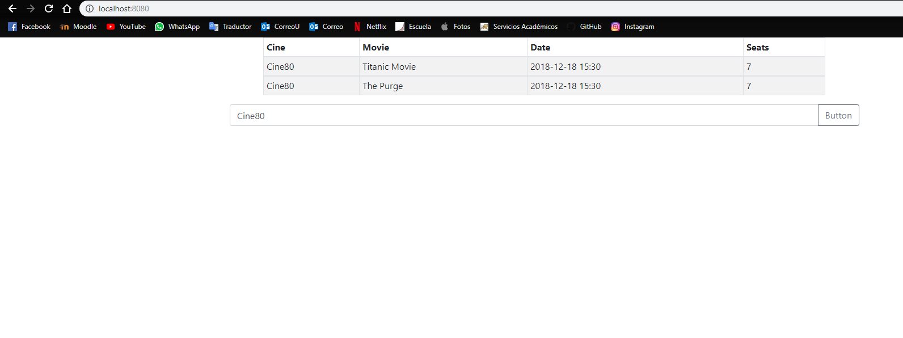
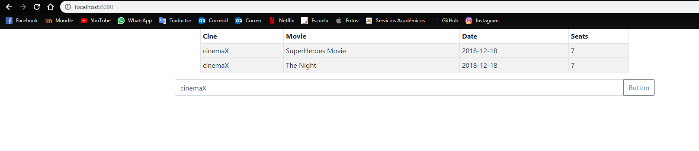

# LAB 7
## Part 	l
In this part I add the index.html file and I made a table show all the information.
## Part 	ll
I added the corresponding files .js what serve to search for cinemas
## Part lll
The front-end is able to do get queries with jQuery.

## Testing
To test the application run `mvn spring-boot:run` on corresponding directory and the open `localhost:8080` on browser.
Then search for `cinemaX` or `cinemaY` using the search bar

### Evidence of the test

